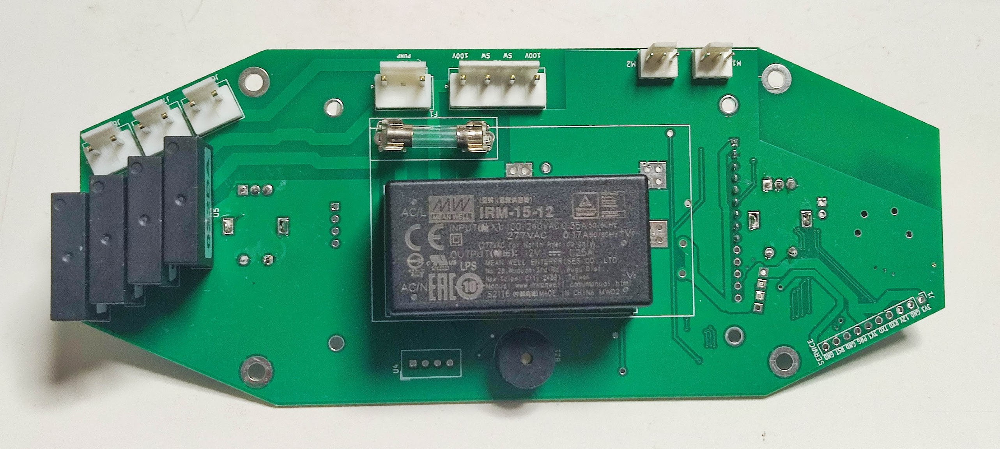
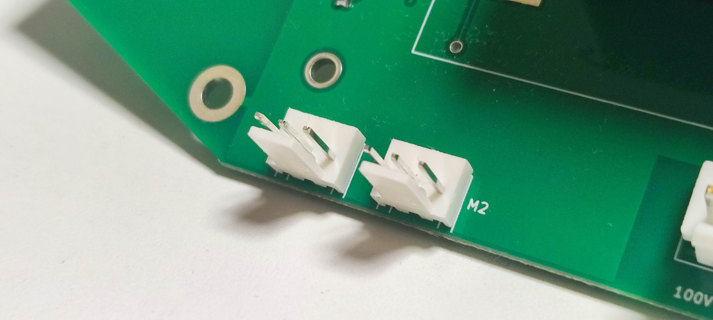
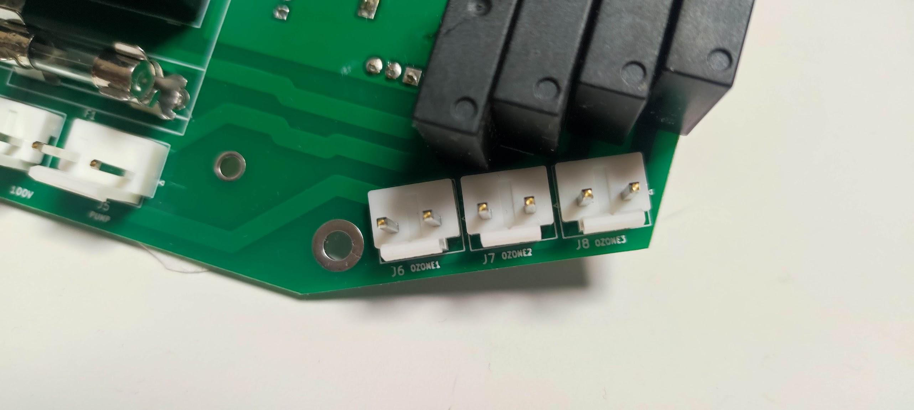
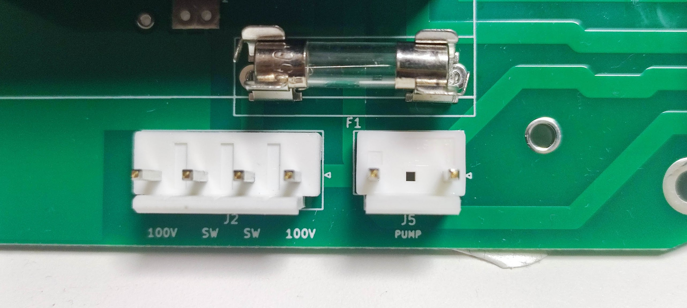
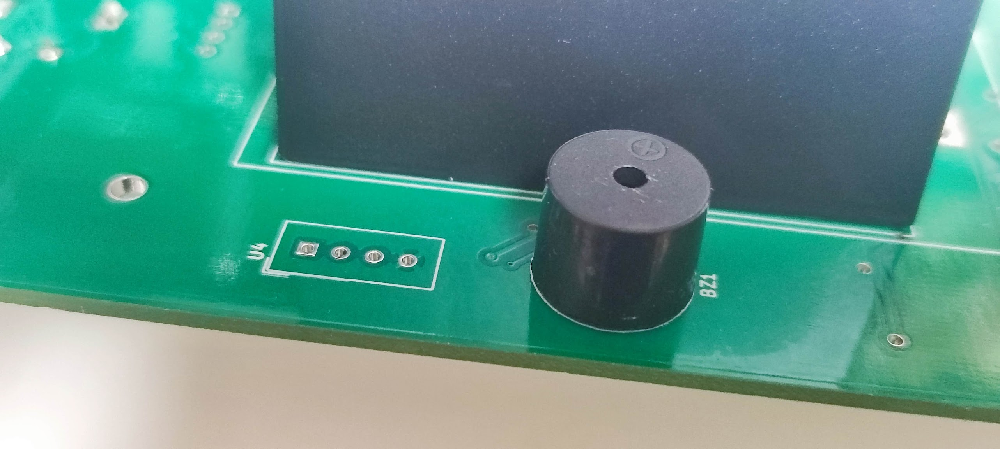

# Esp32DualDialSsr

ESP32 board with 2 rotary encoder and 4 ch SSR.

# OVERVIEW


include AC to 12V DC power module and AC (SSR driven 12V). 


# User Interface
2 rotary encoder and 3.2in TFT LCD module connector


# OUTPUT

2 output but 1ch 12V ON/OFF output for 12V FAN. 


3 + 1 SSR output



Power IN connector (J2) , fuse (F1) and one of SSR output (J5) 


buzzer and temp sensor(optional)


# GPIO settings

## TFT LCD

```
  static constexpr int dma_channel = 1;
  static constexpr int spi_sclk = 18;
  static constexpr int spi_mosi = 23;
  static constexpr int spi_miso = 19;
  static constexpr int spi_dlen = 8;
#define TFT_RST 16
#define TFT_DC 17
#define TFT_CS 5
#define TFT_BACKLIGHT_PIN 4
```

## Rotary Encoder

#define ENCODER1_A_PIN 34
#define ENCODER1_B_PIN 35
#define ENCODER1_SWITCH_PIN 25
#define ENCODER2_A_PIN 12
#define ENCODER2_B_PIN 13
#define ENCODER2_SWITCH_PIN 14


## SSR


```
#define PUMP_PIN 27
SSR control GPIO 26,32,33
```

# OTHER

```
#define FAN_PIN 22
#define BEEP_PIN 2
```

